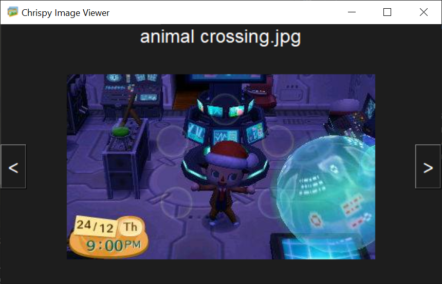

# tkinter-image-viewer
[](https://www.codefactor.io/repository/github/cbridges851/tkinter-image-viewer)  
This is my second project I have made while learning Tkinter. It is an application that allows you to view images that are in the images folder by the Python file.

## Motivation
In freeCodeCamp's Tkinter course (https://www.youtube.com/watch?v=YXPyB4XeYLA&t=2331s), I had learnt about using icons, images and making exit buttons. I didn't make an exit button for this application, but I found it straightforward anyway, but I did practise putting images onto the application and changing the icon of the window.

## Tech/Framework
[Tkinter](https://docs.python.org/3/library/tkinter.html) - a standard library in Python to make applications with GUIs.

## Prerequisites

- [Python](https://www.python.org/downloads/)
- [Git](https://git-scm.com/)

## Installation
- Clone the project via your terminal: `https://github.com/cBridges851/tkinter-image-viewer.git`
    ```sh
    git clone https://github.com/cBridges851/tkinter-image-viewer.git

    cd tkinter-image-viewer
    ```
- Make sure you have the Pillow and Tkinter package installed.      
    - You can manually install them through [Pip](https://pip.pypa.io/en/stable/) by executing the following commands simultaneously.
        `````sh
        pip install tk
        pip install Pillow
        `````
        OR

    - Use the [requirements.txt](https://learnpython.com/blog/python-requirements-file/) file present in the repo to install them.
        `````sh
        pip install -r requirements.txt
        `````


- In your terminal, execute `python image-viewer.py` to run the application.
    ```sh
    python run.py
    ```

## How To Use
- To view images:
    - When the application has opened as per above, you should see an interface that looks like this:
    
    - To navigate through the pictures, either click on the arrow buttons on the sides, or press the arrow keys on your keyboard.
- To change the images in the viewer:
    - Navigate to the images folder in the project's directory in the file explorer, and add or remove images!

## Contributing
Take a gander of the [Contributing.md](https://github.com/cBridges851/tkinter-image-viewer/blob/master/Contributing.md) for the guidelines. Checkout the open issues to see if there are any you would like to take on and express your interest in the thread. However, if you have any other ideas, feel free to create a new issue!

Feel free to send me any feedback on the contributing process, here are the places you can reach me: <br>
LinkedIn: https://www.linkedin.com/in/christa-bridges/ <br>
Twitter: https://twitter.com/christa_bridges <br>
Instagram: https://www.instagram.com/the_chrispy_1/ <br> 
Or send a pigeon.
